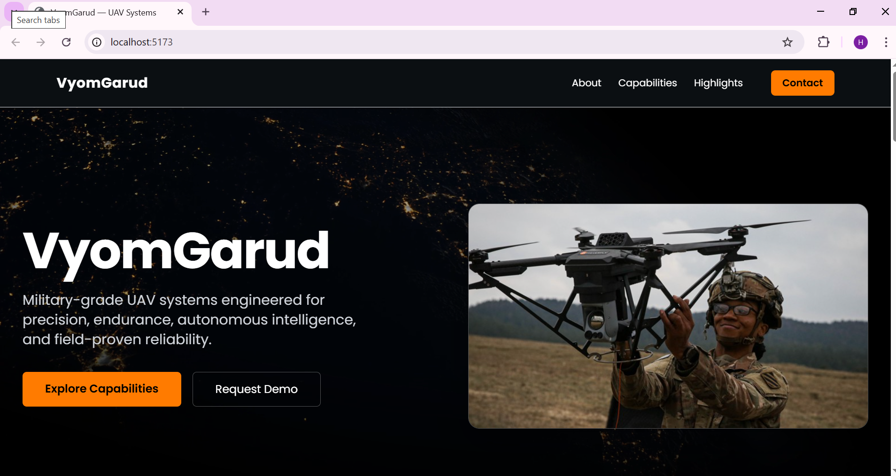
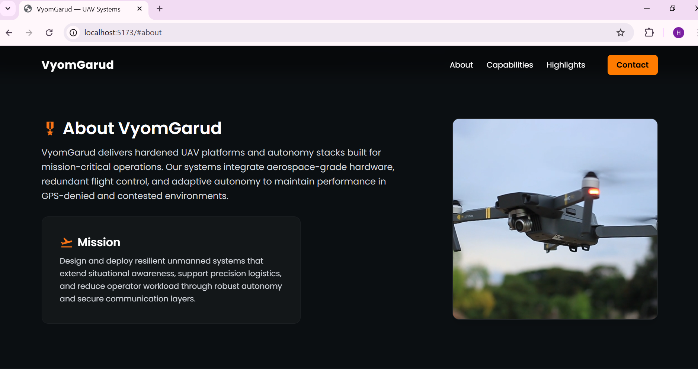
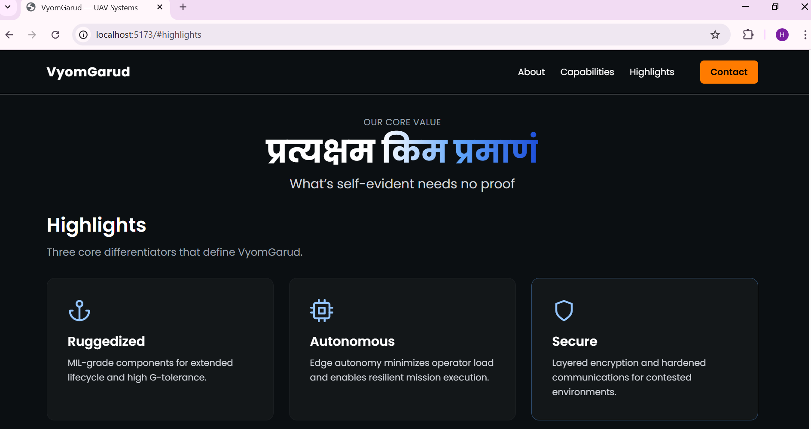

# VyomGarud Landing Page


---

## 🛩️ Overview

VyomGarud builds military-grade UAV/drone systems with a focus on reliability, precision, and advanced autonomy. This repository contains a modern, responsive landing page tailored for VyomGarud, inspired by competitors [Onomondo](https://onomondo.com/) and [Raphe](https://www.raphe.com/).


---

## 🚀 Features

- Dark, modern, slightly military/futuristic UI
- **Colors:** charcoal, white, orange (`#ff7b00`)
- **Fonts:** Poppins, Inter, or Montserrat
- Responsive layout for all devices
- Hero, About, Products, Highlights, and Contact sections
- Subtle animations (CSS/Framer Motion)
- All images/screenshots in `/public/screenshots/`

---

## 📋 Sections

1. **Hero:** Company name ‘VyomGarud’, tagline, CTA, bold visual  slideshow
2. **About:** Mission summary video 
3. **Capabilities/Products:** 3–4 cards  slideshow
4. **Highlights:** 3 concise feature bullets and taglines 
5. **Contact/Footer:** Simple form/links
6. **Footer:** Simple footer
6. **Navbar:** Simple navbar

---

## 🛠️ Stack & Tools

- **Framework:** React
- **Styling:** Tailwind CSS 
- **Animation:** Framer Motion 
- **Assets:** Free icons/images with react-icon and public videos

---

## 🧑‍💻 Getting Started

### Prerequisites

- Node.js & npm installed

### Setup
```
git clone https://github.com/hs024/Vyomgarud_landing_page
cd vyomgarud_landing_page
npm install
npm run dev
```
---

### Screenshots









---

## 🏗️ Design Notes


- Components structured for reusability: `Hero.js`, `About.js`, `ProductCard.js`, `Highlights.js`, `ContactForm.js`
- Colors: Charcoal background, white text, orange accent
- Fonts imported via Google Fonts or local assets
- Animations: Framer Motion for subtle hover/transitions

---

## 🌐 Deployment Notes (Optional)

Deployed to https://hs024.github.io/Vyomgarud_landing_page/


---


## design by
- himanshu
